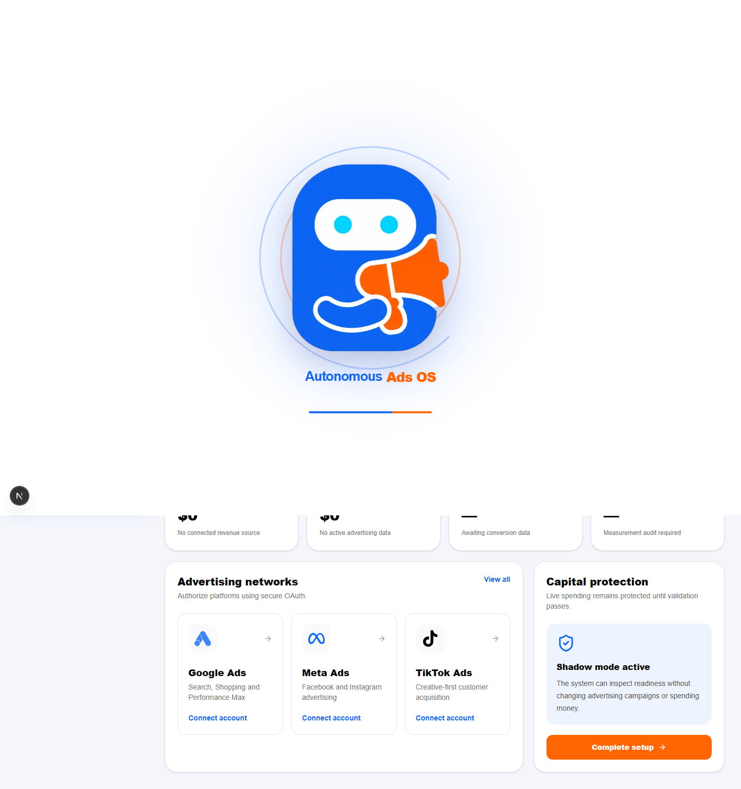
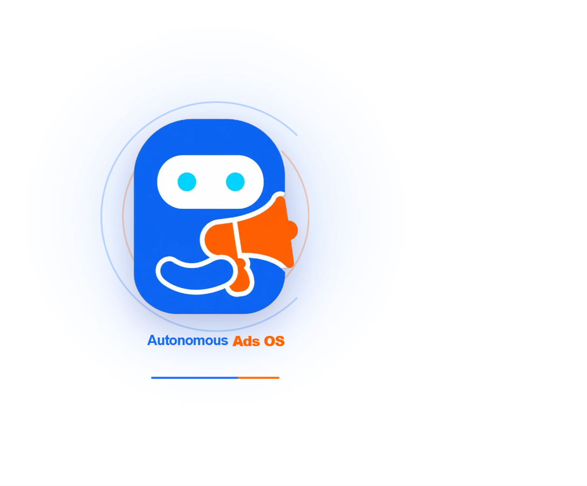
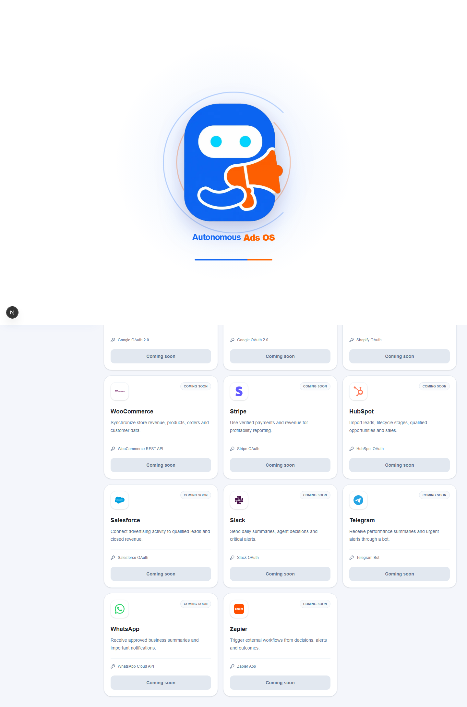
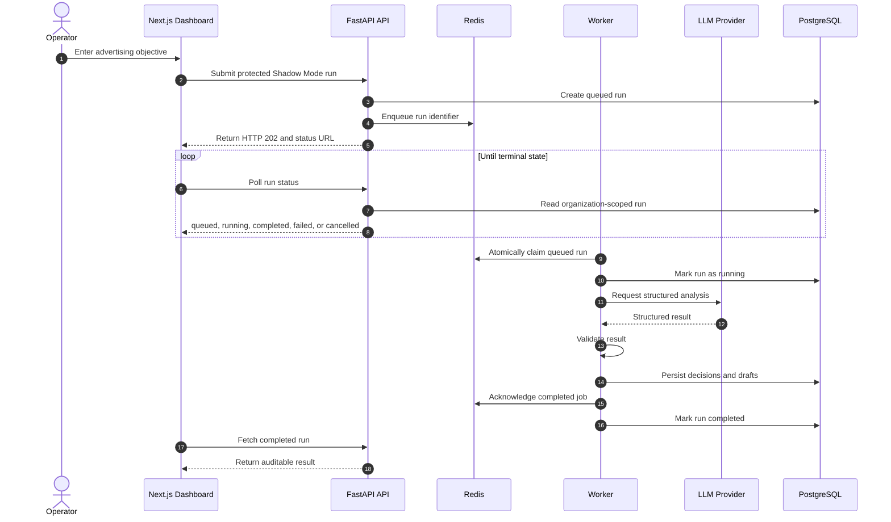
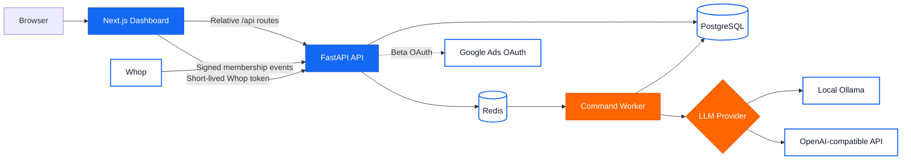
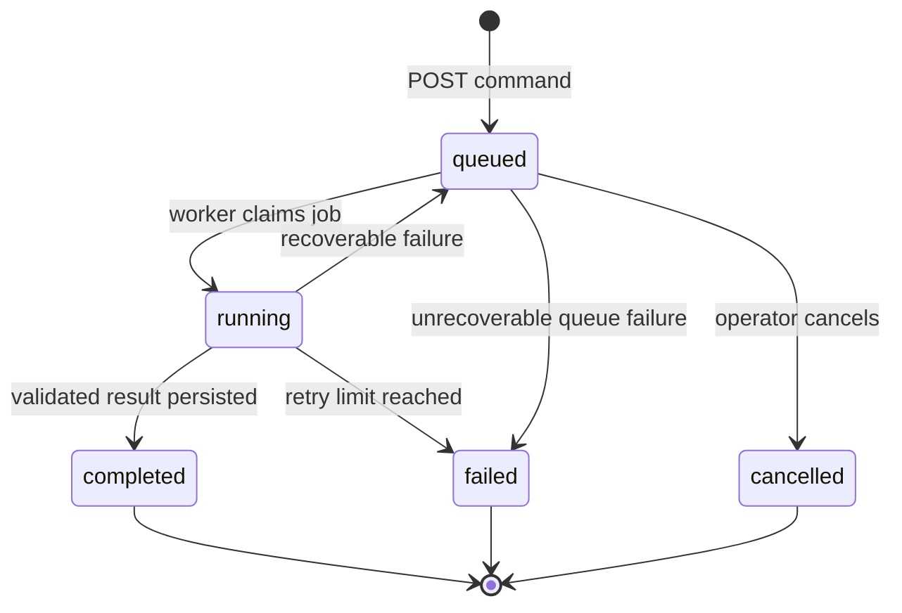
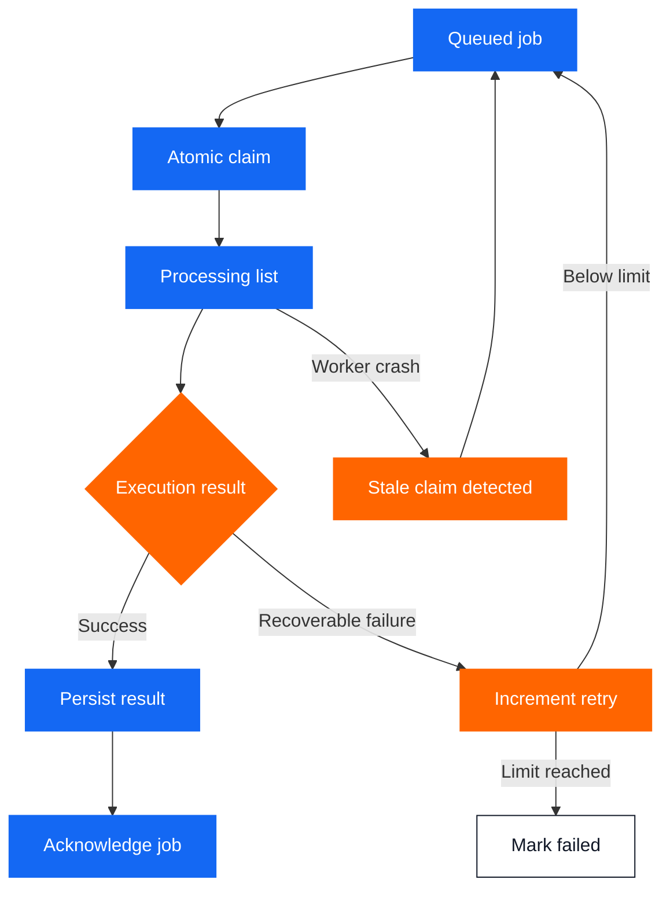
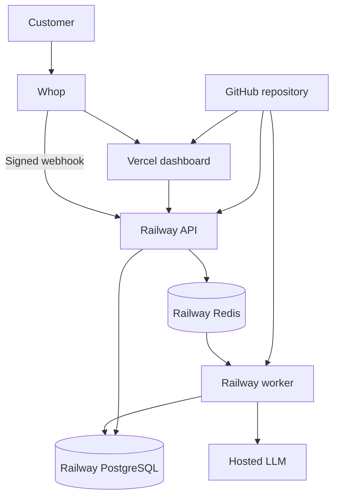
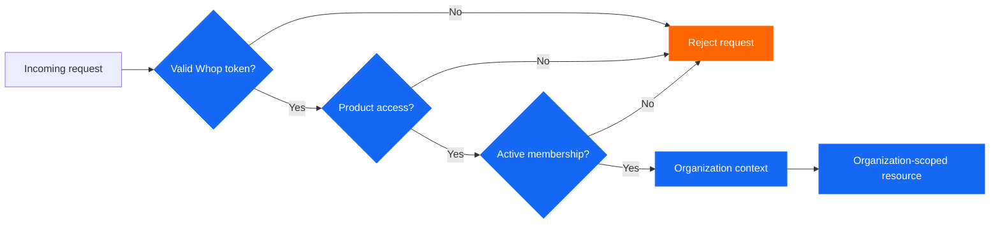

<div align="center">

<h1>Autonomous Ads OS</h1>

<p>
  <strong>An open-source AI control plane for advertising strategy, campaign drafts, and auditable decisions.</strong>
</p>

<p>
  Turn a business objective into a protected, reviewable advertising plan without giving an AI permission to spend money.
</p>

<p>
  <a href="https://github.com/mohamedsaidyekhlef-png/autonomous-ads-os/actions/workflows/ci.yml">
    
  </a>
  
  
  
  
  
  
  
</p>

<p>
  <a href="#product-tour">Product tour</a>
  ·
  <a href="#architecture">Architecture</a>
  ·
  <a href="#quickstart">Quickstart</a>
  ·
  <a href="#capability-status">Capabilities</a>
  ·
  <a href="#roadmap">Roadmap</a>
</p>

<p>
  <a href="https://github.com/mohamedsaidyekhlef-png/autonomous-ads-os">
    
  </a>
</p>

</div>

<table>
  <tr>
    <td>Release stage</td>
    <td>Shadow Beta</td>
  </tr>
  <tr>
    <td>Live ad spending</td>
    <td>Disabled</td>
  </tr>
  <tr>
    <td>Campaign mutations</td>
    <td>Disabled</td>
  </tr>
  <tr>
    <td>Primary output</td>
    <td>Analysis, recommendations, decisions, reports, and campaign drafts</td>
  </tr>
  <tr>
    <td>Safety model</td>
    <td>Human review with mandatory DRY_RUN</td>
  </tr>
</table>

> [!IMPORTANT]
> Autonomous Ads OS is a Shadow Beta. It produces protected analysis and local campaign drafts. It does not automatically publish campaigns, mutate advertising accounts, change live budgets, or spend customer money.



<a id="why-autonomous-ads-os"></a>
<h2>Why Autonomous Ads OS?</h2>

Advertising teams operate across platform dashboards, reports, spreadsheets, attribution tools, creative libraries, and disconnected AI conversations.

That fragmentation makes important questions difficult to answer:

<ul>
  <li>Why was this recommendation produced?</li>
  <li>Which account data and assumptions were used?</li>
  <li>Did the AI create a suggestion or perform a live action?</li>
  <li>Can the recommendation be audited later?</li>
  <li>Can one customer access another customer’s data?</li>
  <li>What happens if a worker crashes during analysis?</li>
  <li>Can a duplicated request create duplicated decisions?</li>
</ul>

Autonomous Ads OS brings these workflows into one organization-scoped operating environment.

It provides:

<ul>
  <li>A natural-language AI Ads Command Center.</li>
  <li>Durable background execution through Redis.</li>
  <li>A separate worker process for long-running LLM operations.</li>
  <li>Structured and validated AI output.</li>
  <li>Persisted recommendations, decisions, reports, and campaign drafts.</li>
  <li>Organization-scoped API access.</li>
  <li>Whop identity and product-entitlement enforcement.</li>
  <li>Verified and idempotent membership webhooks.</li>
  <li>Explicit Shadow Mode safety boundaries.</li>
</ul>

The project is designed around a simple principle:

<blockquote>
  AI should help advertising teams reason, draft, measure, and review before it receives permission to act.
</blockquote>

<a id="product-tour"></a>
<h2>Product tour</h2>

<h3>Command your AI Ads Team</h3>

The Command Center accepts a business objective and queues it for protected background analysis.

A run can move through the following states:

```text
queued
running
completed
failed
cancelled
```

The dashboard polls the run endpoint, displays elapsed time and errors, stores the latest run in browser storage, and survives a page refresh.



<h3>Integration workspace</h3>

The integration workspace distinguishes available integration work from planned connectors.

Google Ads has beta OAuth scaffolding. Unsupported integrations such as Meta Ads and TikTok Ads remain marked as Coming soon.



<a id="how-it-works"></a>
<h2>How it works</h2>



<a id="architecture"></a>
<h2>Architecture</h2>



<h3>Service responsibilities</h3>

<table>
  <thead>
    <tr>
      <th>Service</th>
      <th>Responsibility</th>
    </tr>
  </thead>
  <tbody>
    <tr>
      <td>Next.js dashboard</td>
      <td>Command submission, status polling, organization records, connections, and reports</td>
    </tr>
    <tr>
      <td>FastAPI API</td>
      <td>Authentication, authorization, validation, organization isolation, and queue submission</td>
    </tr>
    <tr>
      <td>PostgreSQL</td>
      <td>Organizations, users, memberships, runs, decisions, drafts, reports, and webhook records</td>
    </tr>
    <tr>
      <td>Redis</td>
      <td>Queued jobs, claimed jobs, claim timestamps, and bounded retry counters</td>
    </tr>
    <tr>
      <td>Command worker</td>
      <td>LLM execution, output validation, result persistence, retries, and acknowledgment</td>
    </tr>
    <tr>
      <td>Whop</td>
      <td>Customer identity, product entitlement, membership lifecycle, and payment access</td>
    </tr>
    <tr>
      <td>LLM provider</td>
      <td>Local Ollama development or configurable OpenAI-compatible hosted inference</td>
    </tr>
  </tbody>
</table>

<a id="run-lifecycle"></a>
<h2>Run lifecycle</h2>



<h3>Crash-safety model</h3>

The queue uses separate queued and processing collections.

A worker atomically moves a run from the queue into the processing collection. It acknowledges the job only after processing and persistence complete.

If a worker crashes:

<ol>
  <li>The claimed job remains in the processing collection.</li>
  <li>The claim timestamp becomes stale.</li>
  <li>Recovery returns the job to the queue.</li>
  <li>The database run returns to a recoverable queued state.</li>
  <li>The bounded retry counter prevents an infinite failure loop.</li>
</ol>



<a id="capability-status"></a>
<h2>Capability status</h2>

<table>
  <thead>
    <tr>
      <th>Capability</th>
      <th>Status</th>
      <th>Current behavior</th>
    </tr>
  </thead>
  <tbody>
    <tr>
      <td>AI Ads Command Center</td>
      <td>Implemented</td>
      <td>Accepts protected Shadow Mode objectives</td>
    </tr>
    <tr>
      <td>Durable Redis queue</td>
      <td>Implemented</td>
      <td>Atomic claim, acknowledgment, stale recovery, and bounded retries</td>
    </tr>
    <tr>
      <td>Separate worker</td>
      <td>Implemented</td>
      <td>Runs LLM operations outside API requests</td>
    </tr>
    <tr>
      <td>Run cancellation</td>
      <td>Implemented</td>
      <td>Queued jobs can be cancelled</td>
    </tr>
    <tr>
      <td>Structured LLM output</td>
      <td>Implemented</td>
      <td>Responses are validated before persistence</td>
    </tr>
    <tr>
      <td>Local Ollama</td>
      <td>Implemented</td>
      <td>Supports local development</td>
    </tr>
    <tr>
      <td>OpenAI-compatible LLM</td>
      <td>Implemented</td>
      <td>Requires a provider URL, API key, and model</td>
    </tr>
    <tr>
      <td>Organization-scoped records</td>
      <td>Implemented</td>
      <td>Campaigns, decisions, experiments, creatives, reports, and settings</td>
    </tr>
    <tr>
      <td>Whop identity verification</td>
      <td>Implemented</td>
      <td>Production requires a verified short-lived token</td>
    </tr>
    <tr>
      <td>Whop entitlement check</td>
      <td>Implemented</td>
      <td>Production access requires the configured product</td>
    </tr>
    <tr>
      <td>Whop webhooks</td>
      <td>Implemented</td>
      <td>Signed and idempotent membership synchronization</td>
    </tr>
    <tr>
      <td>Campaign creation</td>
      <td>Shadow draft</td>
      <td>Creates reviewable database drafts only</td>
    </tr>
    <tr>
      <td>Google Ads OAuth</td>
      <td>Beta scaffold</td>
      <td>Requires credentials and production validation</td>
    </tr>
    <tr>
      <td>Meta Ads</td>
      <td>Planned</td>
      <td>Coming soon</td>
    </tr>
    <tr>
      <td>TikTok Ads</td>
      <td>Planned</td>
      <td>Coming soon</td>
    </tr>
    <tr>
      <td>Automatic publishing</td>
      <td>Disabled</td>
      <td>Not implemented during Shadow Beta</td>
    </tr>
    <tr>
      <td>Automatic budget changes</td>
      <td>Disabled</td>
      <td>Not implemented during Shadow Beta</td>
    </tr>
    <tr>
      <td>Automatic spending</td>
      <td>Disabled</td>
      <td>Not implemented during Shadow Beta</td>
    </tr>
  </tbody>
</table>

<a id="what-shadow-mode-means"></a>
<h2>What Shadow Mode means</h2>

Shadow Mode is a technical safety boundary.

```text
DRY_RUN=true
```

The settings validator rejects `DRY_RUN=false` during the Shadow Beta.

<table>
  <thead>
    <tr>
      <th>Allowed</th>
      <th>Blocked</th>
    </tr>
  </thead>
  <tbody>
    <tr>
      <td>Analyze organization context</td>
      <td>Publish live campaigns</td>
    </tr>
    <tr>
      <td>Create recommendations</td>
      <td>Increase advertising budgets</td>
    </tr>
    <tr>
      <td>Create local campaign drafts</td>
      <td>Change live targeting</td>
    </tr>
    <tr>
      <td>Store decisions and reports</td>
      <td>Pause or activate live ads</td>
    </tr>
    <tr>
      <td>Evaluate measurement readiness</td>
      <td>Perform unattended platform mutations</td>
    </tr>
    <tr>
      <td>Prepare experiments for review</td>
      <td>Spend customer money</td>
    </tr>
  </tbody>
</table>

<a id="technology"></a>
<h2>Technology</h2>

<table>
  <thead>
    <tr>
      <th>Layer</th>
      <th>Technology</th>
    </tr>
  </thead>
  <tbody>
    <tr>
      <td>Dashboard</td>
      <td>Next.js 16, React 19, TypeScript, Tailwind CSS</td>
    </tr>
    <tr>
      <td>API</td>
      <td>FastAPI, Pydantic, SQLAlchemy</td>
    </tr>
    <tr>
      <td>Database</td>
      <td>PostgreSQL</td>
    </tr>
    <tr>
      <td>Queue</td>
      <td>Redis</td>
    </tr>
    <tr>
      <td>Migrations</td>
      <td>Alembic</td>
    </tr>
    <tr>
      <td>Authentication</td>
      <td>Whop token verification and entitlement checks</td>
    </tr>
    <tr>
      <td>Webhooks</td>
      <td>Standard Webhooks</td>
    </tr>
    <tr>
      <td>Local AI</td>
      <td>Ollama</td>
    </tr>
    <tr>
      <td>Hosted AI</td>
      <td>OpenAI-compatible APIs</td>
    </tr>
    <tr>
      <td>Deployment</td>
      <td>Docker, Railway, and Vercel</td>
    </tr>
    <tr>
      <td>Quality</td>
      <td>Ruff, Pytest, ESLint, Next.js build, GitHub Actions</td>
    </tr>
  </tbody>
</table>

<a id="repository-structure"></a>
<h2>Repository structure</h2>

```text
autonomous-ads-os/
├── app/
│   ├── api/                 FastAPI routes
│   ├── core/                Settings and authorization
│   ├── database/            Models and database sessions
│   ├── llm/                 LLM provider transport
│   ├── workflows/           Durable Redis queue
│   ├── main.py              API application
│   └── worker.py            Command worker
├── dashboard/
│   ├── scripts/             Screenshot capture tooling
│   └── src/                 Next.js application
├── docs/
│   └── screenshots/         Real dashboard captures
├── migrations/              Alembic migrations
├── tests/                   Backend security and workflow tests
├── compose.yaml             Local PostgreSQL and Redis
├── Dockerfile               API image
├── Dockerfile.worker        Worker image
├── railway.toml             Railway configuration
└── README.md                Project documentation
```

<a id="quickstart"></a>
<h2>Quickstart</h2>

<h3>Prerequisites</h3>

Install:

<ul>
  <li>Python 3.12 or newer</li>
  <li>uv</li>
  <li>Node.js 22 or newer</li>
  <li>Docker Desktop</li>
  <li>Ollama or an OpenAI-compatible API provider</li>
</ul>

<h3>Clone</h3>

```bash
git clone https://github.com/mohamedsaidyekhlef-png/autonomous-ads-os.git
cd autonomous-ads-os
```

<h3>Start PostgreSQL and Redis</h3>

```bash
docker compose up -d
```

Check the services:

```bash
docker compose ps
```

<h3>Create local configuration</h3>

Linux or macOS:

```bash
cp .env.example .env
```

PowerShell:

```powershell
Copy-Item .env.example .env
```

Keep the following safety settings:

```text
APP_ENV=development
DRY_RUN=true
DEVELOPMENT_AUTH_BYPASS=true
```

Never commit `.env`, `.env.local`, credentials, access tokens, webhook secrets, or customer data.

<h3>Install the backend</h3>

```bash
uv sync
```

Apply migrations:

```bash
uv run alembic upgrade head
```

<h3>Configure local Ollama</h3>

Example configuration:

```text
LLM_PROVIDER=ollama
OLLAMA_BASE_URL=http://localhost:11434
OLLAMA_MODEL=qwen3.5:4b
```

Pull the model:

```bash
ollama pull qwen3.5:4b
```

Confirm Ollama is running:

```bash
ollama list
```

<h3>Start the API</h3>

```bash
uv run uvicorn app.main:app --reload --host 127.0.0.1 --port 8080
```

Open:

```text
http://127.0.0.1:8080/docs
```

Check liveness:

```text
http://127.0.0.1:8080/health
```

Check dependencies:

```text
http://127.0.0.1:8080/ready
```

<h3>Start the worker</h3>

Open a second terminal:

```bash
uv run python -m app.worker
```

Expected startup message:

```text
command worker started
```

<h3>Start the dashboard</h3>

Open a third terminal:

```bash
npm --prefix dashboard install
npm --prefix dashboard run dev
```

Open:

```text
http://localhost:3000/overview
```

<a id="configuration"></a>
<h2>Configuration</h2>

<table>
  <thead>
    <tr>
      <th>Variable</th>
      <th>Purpose</th>
      <th>Requirement</th>
    </tr>
  </thead>
  <tbody>
    <tr>
      <td>APP_ENV</td>
      <td>Runtime environment</td>
      <td>Use production in hosted environments</td>
    </tr>
    <tr>
      <td>DRY_RUN</td>
      <td>Mandatory Shadow Mode control</td>
      <td>Must remain true</td>
    </tr>
    <tr>
      <td>DEVELOPMENT_AUTH_BYPASS</td>
      <td>Local authentication bypass</td>
      <td>Must be false in production</td>
    </tr>
    <tr>
      <td>DATABASE_URL</td>
      <td>SQLAlchemy database connection</td>
      <td>Required in production</td>
    </tr>
    <tr>
      <td>REDIS_URL</td>
      <td>Command queue connection</td>
      <td>Required for API and worker</td>
    </tr>
    <tr>
      <td>APP_SECRET_KEY</td>
      <td>Application signing secret</td>
      <td>Generate privately</td>
    </tr>
    <tr>
      <td>TOKEN_ENCRYPTION_KEY</td>
      <td>Fernet token-encryption key</td>
      <td>Generate privately</td>
    </tr>
    <tr>
      <td>LLM_PROVIDER</td>
      <td>Selects Ollama or hosted mode</td>
      <td>Required</td>
    </tr>
    <tr>
      <td>OLLAMA_BASE_URL</td>
      <td>Local Ollama endpoint</td>
      <td>Local Ollama mode</td>
    </tr>
    <tr>
      <td>OLLAMA_MODEL</td>
      <td>Local model name</td>
      <td>Local Ollama mode</td>
    </tr>
    <tr>
      <td>LLM_BASE_URL</td>
      <td>Hosted provider URL</td>
      <td>Hosted mode</td>
    </tr>
    <tr>
      <td>LLM_API_KEY</td>
      <td>Hosted provider secret</td>
      <td>Hosted mode</td>
    </tr>
    <tr>
      <td>LLM_MODEL</td>
      <td>Hosted model identifier</td>
      <td>Hosted mode</td>
    </tr>
    <tr>
      <td>WHOP_API_KEY</td>
      <td>Server-side Whop API key</td>
      <td>Production access</td>
    </tr>
    <tr>
      <td>WHOP_APP_ID</td>
      <td>Whop application identifier</td>
      <td>Production access</td>
    </tr>
    <tr>
      <td>WHOP_REQUIRED_PRODUCT_ID</td>
      <td>Required Whop product</td>
      <td>Production access</td>
    </tr>
    <tr>
      <td>WHOP_WEBHOOK_SECRET</td>
      <td>Webhook verification secret</td>
      <td>Membership synchronization</td>
    </tr>
    <tr>
      <td>DASHBOARD_URL</td>
      <td>Dashboard origin</td>
      <td>Production deployment</td>
    </tr>
    <tr>
      <td>CORS_ORIGINS</td>
      <td>Allowed browser origins</td>
      <td>Production deployment</td>
    </tr>
  </tbody>
</table>

Configuration names are safe to publish. Actual values and secrets are not.

<a id="api"></a>
<h2>Command API</h2>

<h3>Create a run</h3>

```http
POST /v1/command/runs
Content-Type: application/json
Idempotency-Key: unique-request-id
```

Example body:

```json
{
  "command": "Prepare a protected measurement-first search campaign draft.",
  "mode": "shadow",
  "create_campaign_draft": true,
  "selected_agents": [
    "chief_strategy",
    "measurement_auditor",
    "budget_controller",
    "risk_controller"
  ]
}
```

A successful submission returns HTTP `202 Accepted` with the run identifier and current status.

<h3>Read a run</h3>

```http
GET /v1/command/runs/{run_id}
```

<h3>List recent runs</h3>

```http
GET /v1/command/runs
```

<h3>Cancel a queued run</h3>

```http
POST /v1/command/runs/{run_id}/cancel
```

<h3>Receive Whop membership events</h3>

```http
POST /v1/webhooks/whop
```

Production organization endpoints require verified Whop identity, product access, and an active synchronized membership.

<a id="testing"></a>
<h2>Testing</h2>

Backend formatting:

```bash
uv run ruff format app tests
```

Backend lint:

```bash
uv run ruff check app tests
```

Backend tests:

```bash
uv run pytest -v
```

Dashboard dependencies:

```bash
npm --prefix dashboard install
```

Dashboard lint:

```bash
npm --prefix dashboard run lint
```

Dashboard production build:

```bash
npm --prefix dashboard run build
```

Capture documentation screenshots:

```bash
npm --prefix dashboard run capture:screenshots
```

Validate the Git diff:

```bash
git diff --check
```

<a id="deployment"></a>
<h2>Deployment model</h2>



A production deployment requires:

<ul>
  <li>One FastAPI service.</li>
  <li>One or more worker services.</li>
  <li>Persistent PostgreSQL.</li>
  <li>Persistent Redis.</li>
  <li>A hosted LLM provider.</li>
  <li>Whop application credentials.</li>
  <li>A Whop product and webhook.</li>
  <li>Private environment-variable injection.</li>
  <li>Database migrations before deployment.</li>
  <li>DRY_RUN enabled.</li>
  <li>Development authentication bypass disabled.</li>
</ul>

The API exposes:

```text
GET /health
GET /ready
```

The readiness endpoint checks PostgreSQL, Redis, and the selected LLM configuration.

The dashboard uses relative `/api` routes in production. Configure `API_ORIGIN` as a server-side Vercel variable. Never expose secrets through variables beginning with `NEXT_PUBLIC_`.

<a id="security"></a>
<h2>Security model</h2>



The security boundary includes:

<ul>
  <li>Mandatory Shadow Mode.</li>
  <li>Verified short-lived Whop user tokens.</li>
  <li>Server-side Whop product-entitlement checks.</li>
  <li>Organization-scoped database access.</li>
  <li>Standard Webhooks signature verification.</li>
  <li>Idempotent webhook event storage.</li>
  <li>Configurable encrypted token storage.</li>
  <li>Durable queue acknowledgment.</li>
  <li>Bounded retries.</li>
  <li>Stale-job recovery.</li>
  <li>No browser-exposed API secrets.</li>
  <li>Production-deny-by-default authorization.</li>
</ul>

Do not publish vulnerabilities in a public issue. Contact the repository owner privately until a dedicated security policy and private reporting channel are available.

<a id="limitations"></a>
<h2>Current limitations</h2>

This repository is an early Shadow Beta, not a finished autonomous media-buying system.

Current limitations include:

<ul>
  <li>No automatic advertising spending.</li>
  <li>No automatic campaign activation.</li>
  <li>No automatic live-budget mutation.</li>
  <li>Google Ads production OAuth requires external credentials and validation.</li>
  <li>Meta Ads is not connected.</li>
  <li>TikTok Ads is not connected.</li>
  <li>Production operation requires PostgreSQL, Redis, a worker, Whop, and an LLM provider.</li>
  <li>Operators remain responsible for reviewing every recommendation and draft.</li>
  <li>Advertising-platform policy approval may be required before accessing real account data.</li>
</ul>

<a id="roadmap"></a>
<h2>Roadmap</h2>

- [ ] Publish the first tagged Shadow Beta release
- [ ] Add an open-source license
- [ ] Add contributor and security policies
- [ ] Add a complete demo-data command
- [ ] Add browser end-to-end tests
- [ ] Finish production Google Ads read-only OAuth
- [ ] Add encrypted credential rotation
- [ ] Add account discovery
- [ ] Add conversion-measurement audits
- [ ] Add configurable organization roles
- [ ] Add queue observability
- [ ] Add LLM cost and latency observability
- [ ] Add audit-log exports
- [ ] Add Meta Ads read-only integration
- [ ] Add TikTok Ads read-only integration
- [ ] Add human approval workflows
- [ ] Add carefully gated publishing only after dedicated safety review

Live mutation and spending will remain disabled until authorization, policy controls, idempotency, audit logging, human approval, rollback, and platform compliance are independently validated.

<a id="contributing"></a>
<h2>Contributing</h2>

Contributions are welcome in:

<ul>
  <li>Advertising measurement.</li>
  <li>Workflow reliability.</li>
  <li>Queue safety.</li>
  <li>Organization isolation.</li>
  <li>OAuth security.</li>
  <li>Structured LLM evaluation.</li>
  <li>Accessibility.</li>
  <li>Documentation.</li>
  <li>Test coverage.</li>
</ul>

Before submitting a pull request:

<ol>
  <li>Create a focused branch.</li>
  <li>Keep DRY_RUN enabled.</li>
  <li>Do not include credentials or customer data.</li>
  <li>Add or update meaningful tests.</li>
  <li>Run backend and dashboard verification.</li>
  <li>Explain the safety impact of the change.</li>
</ol>

Do not submit changes that enable unattended spending or bypass organization authorization.

<a id="support"></a>
<h2>Support the project</h2>

If this direction is useful:

<ol>
  <li>Star the repository.</li>
  <li>Open a focused issue.</li>
  <li>Share which advertising workflow should be supported next.</li>
  <li>Contribute tests, documentation, or safe read-only integrations.</li>
</ol>

A star helps other builders discover a safer and more auditable approach to AI-assisted advertising operations.

<div align="center">

<p>
  <strong>Built around review, traceability, organization isolation, and capital protection.</strong>
</p>

<p>
  <a href="https://github.com/mohamedsaidyekhlef-png/autonomous-ads-os">
    Star Autonomous Ads OS
  </a>
</p>

</div>
